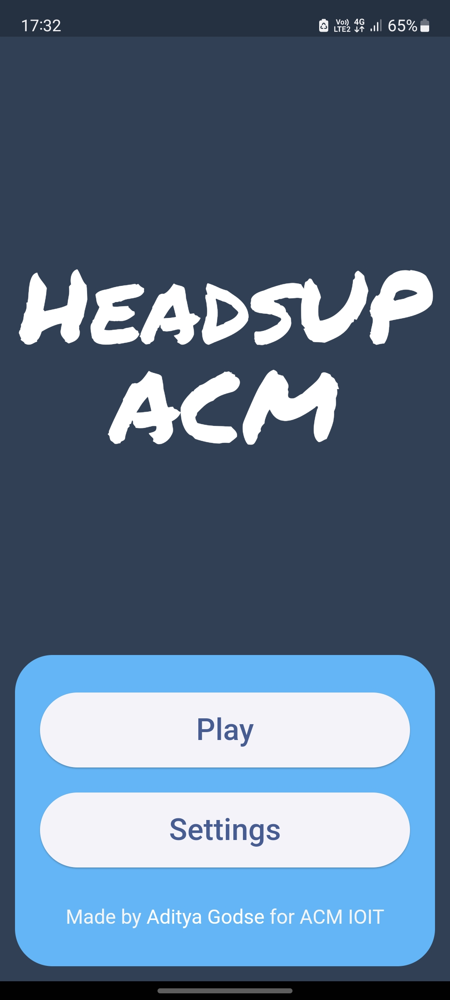
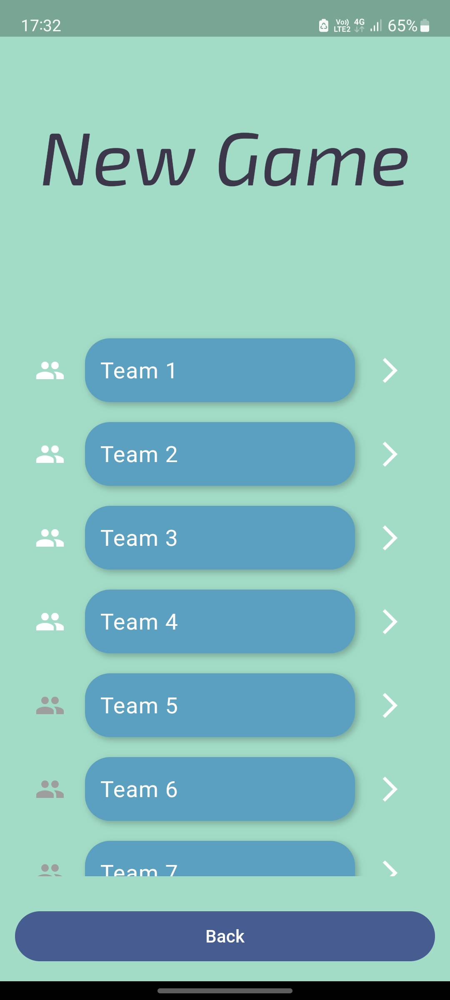
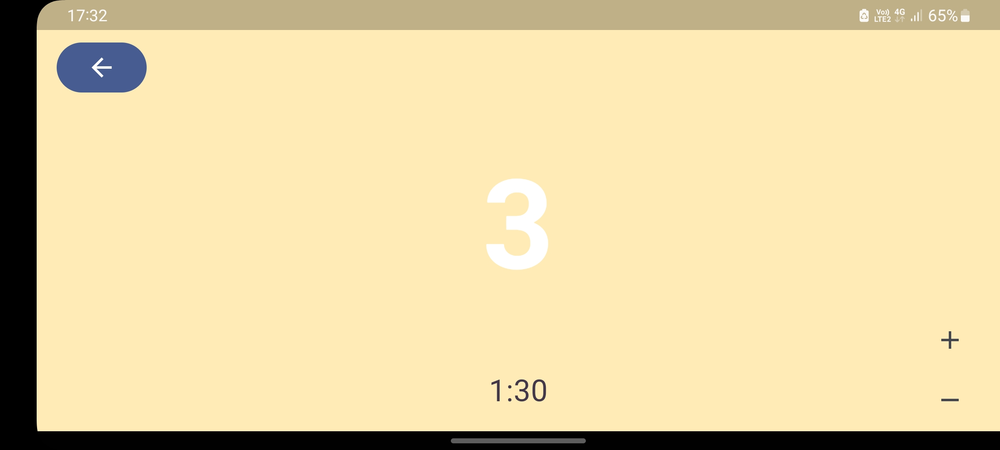
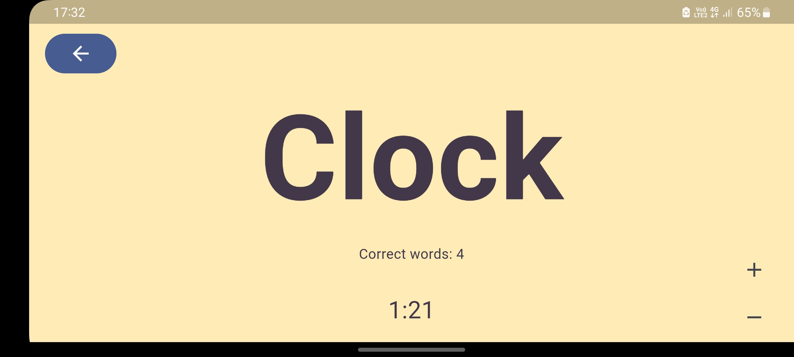
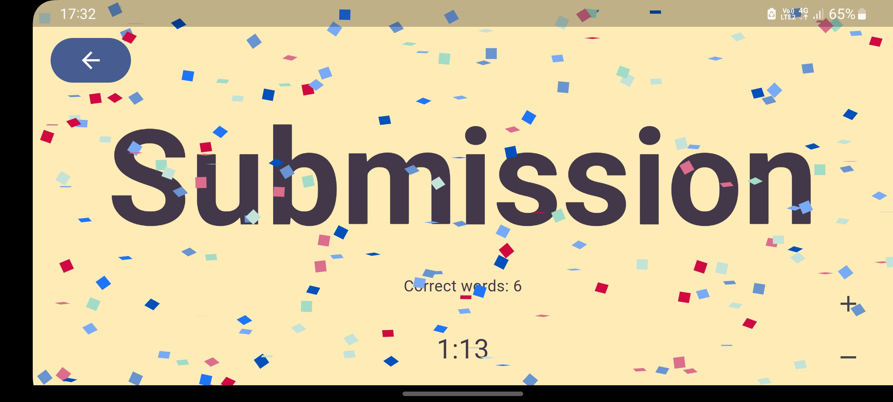
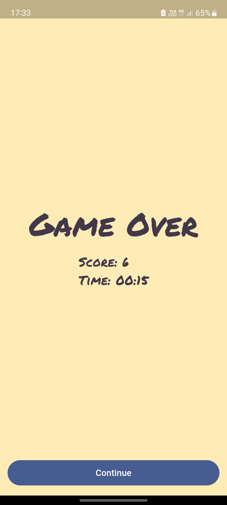

# Heads up ACM

## How to Play:

- Hold your phone to your forehead: The game displays a word on the screen.
- Get clues from your friends: They give you hints, act out the word, or make sounds to help you guess.
- Guess the word before time runs out: Tilt your phone to move on to the next word.

This game is introduced by ellen degeneres, but I needed a word where I can customise the words on the screen. So I created my own version using `flutter` and `sensors_plus` dart package.

Here are some screenshots of the game:

## Screenshots

| Home Page                           | Team selection screen               |
| ----------------------------------- | ----------------------------------- |
|  |  |
|                                     |                                     |

| Game timer                          | Words screen                        |
| ----------------------------------- | ----------------------------------- |
|  |  |
|                                     |                                     |

| game over confetti                  | Game over screen with score         |
| ----------------------------------- | ----------------------------------- |
|  |  |
|                                     |                                     |
